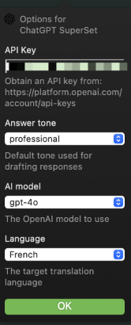

# ChatGPT_Superset.popclipext

This is my custom CharGPT extension for PopClip. Easy to modify; simply edit the code and JavaScript file.

## Install

1. Clone the repo  ** git clone <repo url> **
2. Double click on the toplevel folder with the **.popclipext**
3. Follow PopClip instructions

## Debug

1. run **defaults write com.pilotmoon.popclip EnableExtensionDebug -bool YES**
2. then open **console.app** and apply filter **Process:PopClip Category:Extension**
